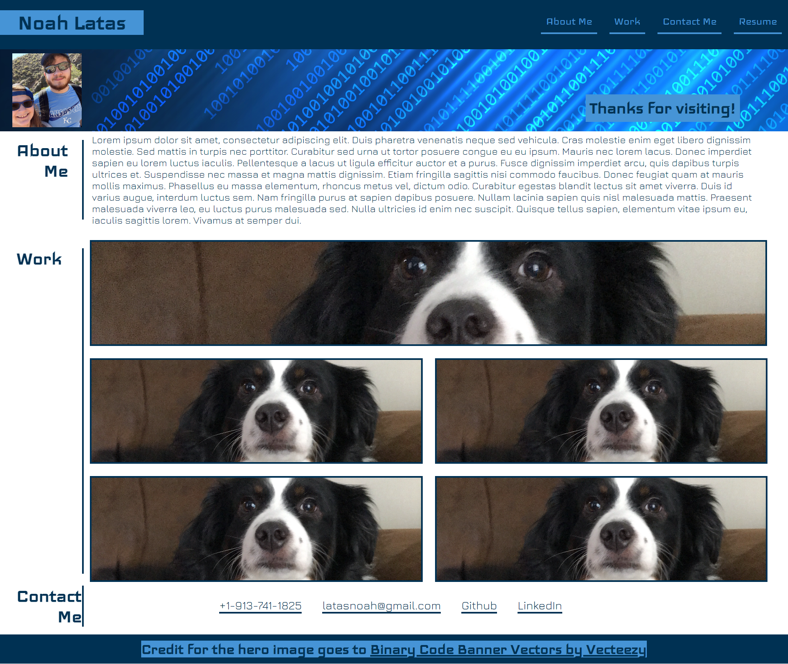
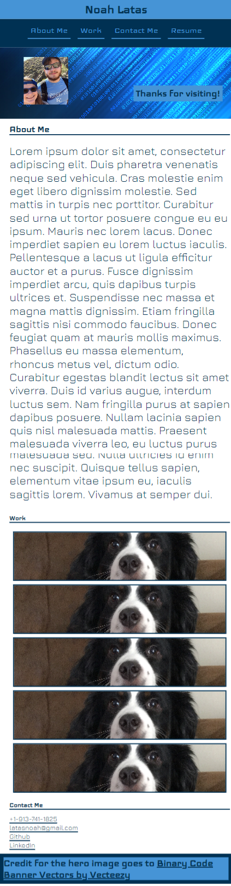

# Noah Latas Portfolio

## Description

AS A web developer, I WANT to show off a portfolio of my work, SO THAT I can show potential employers what I am capable of.

This project aims to improve upon the website by optimizing it better for search engines, and to increase the longevity of the code with improvements to the code base.

This project is a personal portfolio of my work that I can update and use in the future to show potential employers.

(Works are a WIP, placeholder link to portfolio repo for now.)

## Usage

Creates a web-based portfolio to show links to ways to contact me, my resume, and previous work.

## Desktop Version

## Mobile Version

## Credit

[Binary Code Banner by Vecteezy](https://www.vecteezy.com/vector-art/829812-binary-code-banner)

